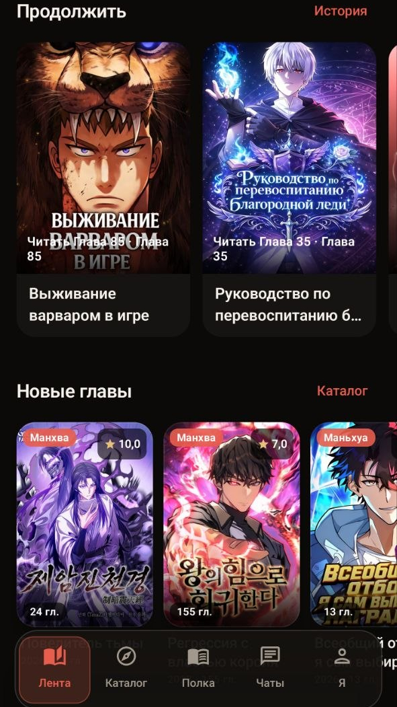
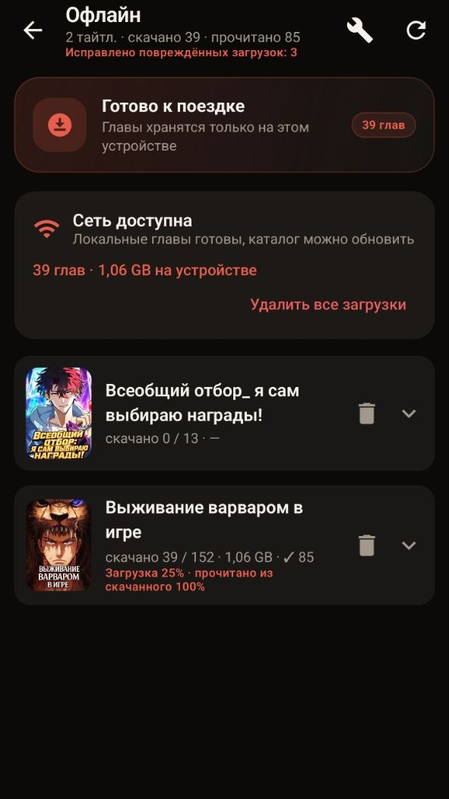
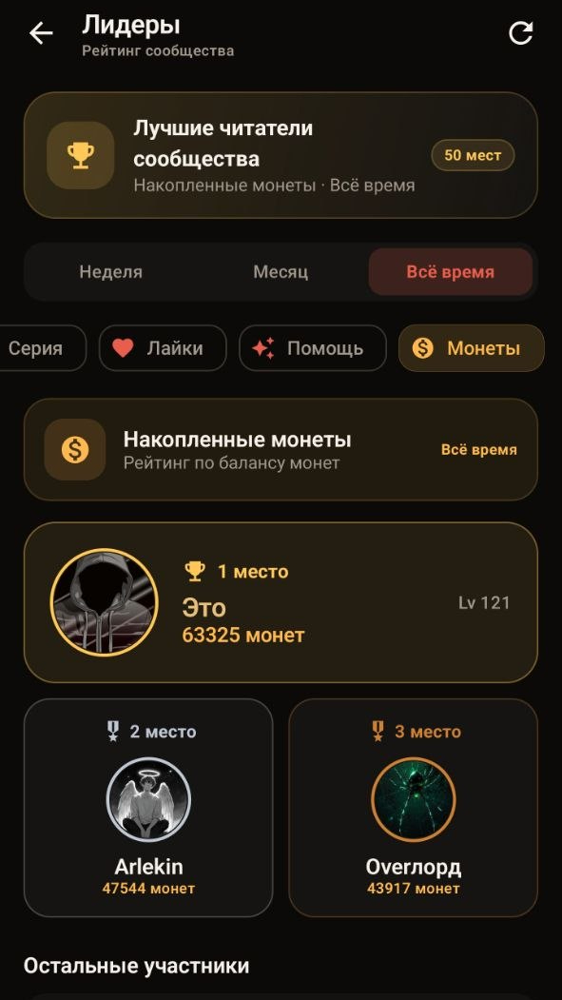

# TOMILO LIB

Читай мангу и манхву с [tomilo-lib.ru](https://tomilo-lib.ru) — лента, каталог, полка и офлайн.

  
  
  
  

**Лента** — продолжить с последней главы, свежие обновления, поиск и жанры.  
**Читалка** — вертикаль, страницы, RTL, яркость, автоскролл.  
**Офлайн** — главы на устройстве, место, проверка файлов. Premium или реклама.  
**Сообщество** — полка по статусам, чаты, друзья, задания, лидеры.

Один аккаунт с сайтом: email, Яндекс или VK.

[Скачать APK](https://github.com/Lugovskoy-Maxim/tomilo-lib-android/releases) · [tomilo-lib.ru](https://tomilo-lib.ru)

Сборка: [`BUILD.md`](BUILD.md)
